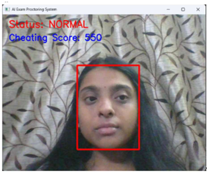
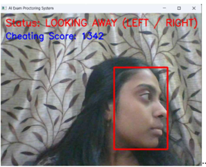
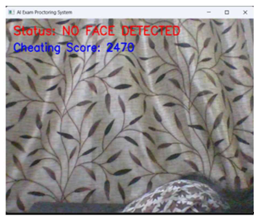
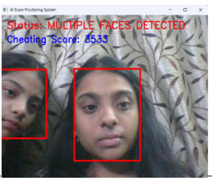
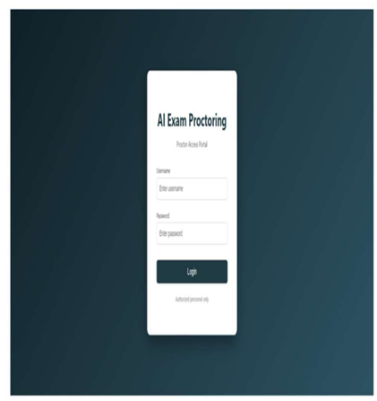
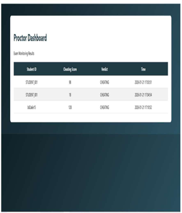

# AI-Based Intelligent Online Exam Proctoring System

## Project Preview

### Normal Monitoring

### Looking Away Detection

### No Face

### Multiple Faces Detection

### Login Page

### Proctor Dashboard

---

## Overview

AI-Based Intelligent Online Exam Proctoring System is a computer vision-based smart monitoring application developed using Python, OpenCV, Flask, and SQLite.

The system monitors students during online examinations using real-time webcam-based face detection and suspicious activity analysis. It detects multiple cheating-related behaviors such as looking away, absence from screen, and multiple face detection while generating a cheating score and verdict automatically.

The project focuses on improving online examination integrity using AI-assisted monitoring and automated proctoring workflows.

---

## Features

* Real-time webcam monitoring
* Face detection using OpenCV
* Looking away detection
* Multiple face detection
* No face detection alerts
* Automatic cheating score generation
* AI-assisted suspicious activity monitoring
* Flask-based proctor dashboard
* SQLite database integration

---

## Technologies Used

* Python
* OpenCV
* Flask
* SQLite
* HTML
* CSS

---

## Project Structure

* `proctoring.py` → AI monitoring and cheating detection logic
* `app.py` → Flask dashboard backend and server connectivity
* `architecture/` → System architecture, technical architecture, and UML diagrams
* `documentation/` → Project documentation and report
* `paper/` → Published research paper
* `ppt/` → Project presentation
* `screenshots/` → Project execution screenshots

---

## Applications

* Online examination monitoring
* Smart AI-based invigilation systems
* Remote assessment platforms
* Academic integrity management
* Automated suspicious activity detection

---

## Architecture and UML Diagrams

The `architecture/` folder contains:

* System Architecture Diagram
* Technical Architecture Diagram
* Use Case Diagram
* Activity Diagram
* Sequence Diagram
* Class Diagram

These diagrams represent the monitoring workflow, backend structure, database interaction, and communication between students and the proctor dashboard.

---

## Note

The documentation and presentation files contain simplified pseudo code representations for academic explanation purposes, while this repository includes the complete working implementation code with updated cheating detection logic, backend integration, and monitoring improvements.

---

## Future Improvements

* Eye tracking integration
* Mobile phone detection
* Browser activity monitoring
* Audio analysis
* Cloud-based deployment
* AI behavior analytics

---
## Authors
A. Harshitha

Project Team
## Developer

Harshitha Algubelli & Team

B.Tech – Computer Science (AI & ML)
